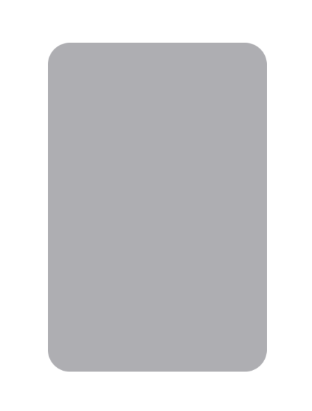
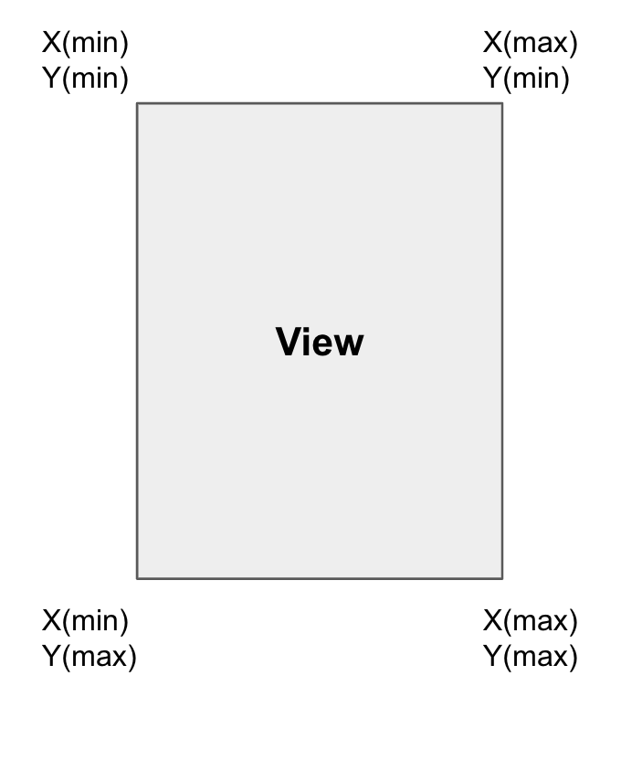
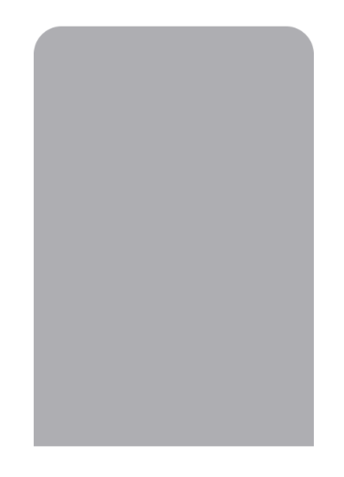

# Corner Radius
> 개발 중 view의 일부분만 cornerRadius를 적용한 상황이 생겼다.   
다른 프로젝트에서도 만날 수 있기 때문에 TIL을 작성한다.

`UIView` 생성 후 진행한다.

---   

## cornerRadius란?
먼저 cornerRadius가 무엇인지 알아보자!   

   

여기 View가 하나 있다.   
이 뷰의 모서리들을 둥글게 해보자



이렇게!   
특정 View의 원하는 모서리에 round 처리하는 것을 바로 `cornerRadius`라고한다.

---

## cornerRadius 사용하기
이제 한번 cornerRadius를 사용해보자.   

`myView`를 추가하고
```swift
myView.layer.cornerRadius = 20
```
요 코드를 추가해 보자!   
그러면 뷰의 모서리가 20만큼 둥글게 변한 것을 볼 수 있다.   

---

## 원하는 부분만 둥글게 처리하기
정말 쉽다!!   
View의 X, Y 좌표를 생각하며 내가 원하는 부분만 둥글게 하면 된다.
 

예를들어 뷰의 윗부분만 둥글게 하고 싶다면   
X(min),Y(min) 과 X(max),Y(min) 에만 round 처리를 하면 되는 것이다.


```swift
myView.layer.cornerRadius = 20

myView.layer.maskedCorners = [.layerMinXMinYCorner, .layerMaxXMinYCorner]
```
이렇게 아까 쓴 코드에 한줄만 더 추가하게 되면   
   
윗부분만 20만큼 둥글게 처리된 것을 볼 수 있다!!!


  


