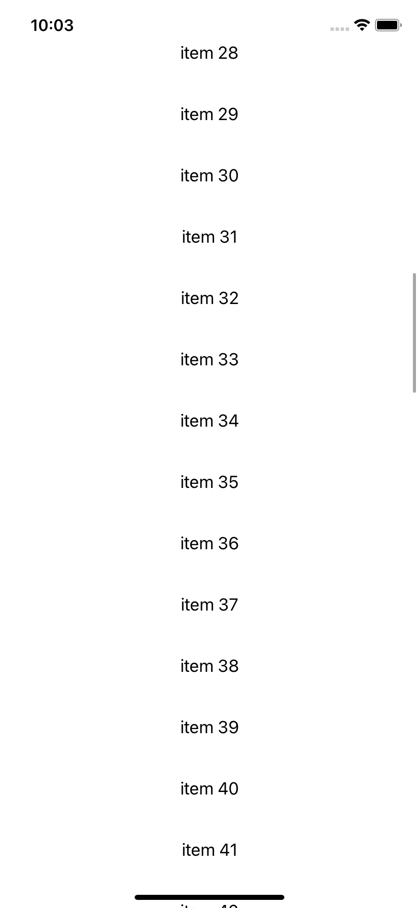
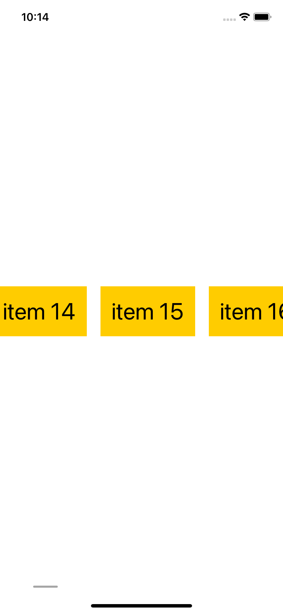

# ScrollView
> View들이 계속 쌓여 화면을 넘어가게 되면 가려져 보이지 않게된다.    
이때, ScrollView를 이용하면 해결이 가능하다.   


## 왜 ScrollView가 필요할까?  
`VStack`을 사용해서 1부터 100까지 나타내보자.   
```swift
VStack{
    ForEach(1..<101){
        Text("item \($0)")
            .padding()
    }
}
```   

아래와 같이 `Text`가 가려져 일부만 보인다.

    

이때 ScrollView를 이용하게 되는 것이다.   

## ScrollView를 사용해보자!
`ScrollView`를 사용하는 방법은 간단하다. `Stack`을 사용했던 것처럼 감싸주기만 하면 된다.

```swift
ScrollView{
    VStack{
        ForEach(1..<101){
            Text("item \($0)")
                .padding()
        }
    }
}
```   
만들어 두었던 `VStack`을 `ScrollView`로 감싸게 되면 각 `Text`가 스크롤 되어 1부터 100까지 나오는걸 확인할 수 있다.   


   

하지만 화면 중앙을 스크롤 해야만 작동이 되는데, 이때 `frame`을 변경해 효율적이게 할 수 있다.

```swift
ScrollView{
    VStack{
        ForEach(1..<101){
            Text("item \($0)")
                .padding()
        }
    }
    .frame(maxWidth: .infinity)
}
```     
    
   

## Horizontal 방향으로 변경   
`ScrollView`는 기본적으로 수직 방향이다. 하지만 `.horizontal`을 이용하면 축을 변경할 수 있다.    
```swift
ScrollView(.horizontal) {
    HStack(spacing: 20) {
        ForEach(1..<101) {
            Text("item \($0)")
                .font(.largeTitle)
                .padding()
                .background(Color.yellow)
        }
    }
    .frame(maxHeight: .infinity)
}
```    

위 코드를 실행하면 수평 방향으로 변경된 것을 볼 수 있다.    
    


## 스크롤 바 숨기기
스크롤 바를 숨기는것 또한 간단하다.

```swift
ScrollView(.horizontal, showsIndicators: false) {
    HStack(spacing: 20) {
        ForEach(1..<101) {
            Text("item \($0)")
                .font(.largeTitle)
                .padding()
                .background(Color.yellow)
        }
    }
    .frame(maxHeight: .infinity)
}
```    
`showsIndicators`의 값을 `false`로 적용하면 스크롤 바가 없어지는 것을 볼 수 있다.