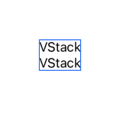
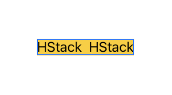
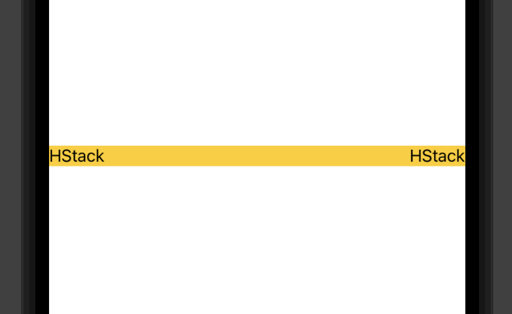
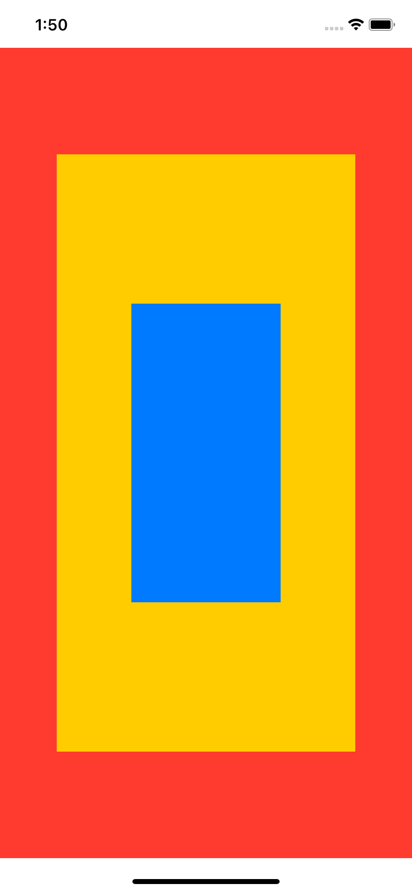
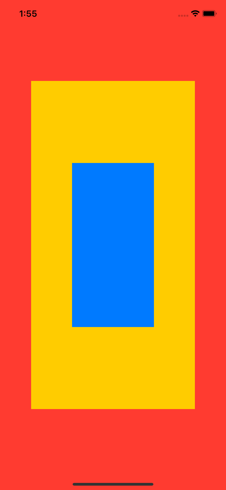

# Stack
> stack들의 기본적인 사용법에 대해 정리한다.

## VStack (Vertical Stack)
`VStack`은 수직으로 `View`을 쌓는다.   
 두 개의 `Text`를 `VStack`으로 감싸보자
 ```swift
VStack{
    Text("VStack")
    Text("VStack")
}
 ```   

아래와 같이 세로로 `Text`가 쌓여진 모습을 볼 수 있다.   

   
- VStack의 텍스트 크기가 다르면 중앙으로 정렬이된다.   

## HStack (Horizontal Stack)
`HStack`은 수평으로 `View`를 쌓는다.
`HStack`도 사용해보자
```swift
HStack{
    Text("HStack")
    Text("HStack")
}
.background(Color.yellow)
 ```  
이번에는 `HStack`의 `BackgroundColor`를 노랗게 바꿔보았다.  

    

위 사진처럼 `Text`가 가로로 쌓인 것을 볼 수 있다.   
또한 배경색이 딱 `Text`의 크기만큼 바뀐 것을 볼 수 있는데 각 `Stack`은 자식의 크기만큼 늘어난다.

그렇다면 텍스트들을 뷰의 양쪽 끝에 위치하도록 하고싶다면 어떻게 해야할까?

이때 `Spacer`를 이용하면 이 문제를 해결 할 수 있다.

`HStack`안에 있는 각 `Text`들 사이에 `Spacer`를 사용해보자
```swift
HStack{
    Text("HStack")
    Spacer()
    Text("HStack")
}
.background(Color.yellow)
 ```    

      

 `Text`들 사이에 공간이 생긴 것을 볼 수 있다.   

`Spacer`를 선언하면 별도의 옵션을 주지 않는 이상 가능한 모든 영역을 차지하게 되며, 부모 뷰인 `HStack`도 늘어나게 된다.   

## ZStack
`ZStack`은 z축으로 자식 뷰를 중첩하여 쌓는다. `View`를 겹쳐 표현할 때 사용한다.

```swift
ZStack{
    Color.red
    Color.yellow.frame(width: 300, height: 600)            
    Color.blue.frame(width: 150, height: 300)
}
```    

`ZStack`에 세개의 색상을 추가했다.   

    

그런데 색상을 추가해도 `SafeArea`까지는 적용이 되지 않는다.   
이때 `edgesIgnoringSafeArea`옵션을 이용하면 적용시킬 수 있다.   

```swift
ZStack{
    Color.red
    Color.yellow.frame(width: 300, height: 600)            
    Color.blue.frame(width: 150, height: 300)
}
.edgesIgnoringSafeArea(.all)
```     
